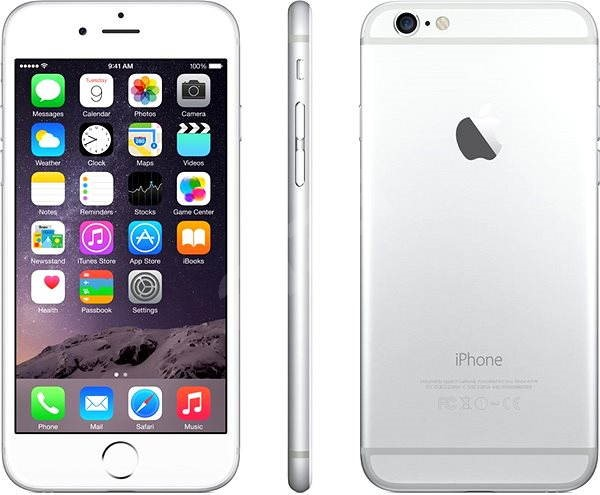

## Apple Iphone 6s

{: .imgc}

- Resolutie van 1334 x 750 pixels bij 326 ppi
- Retina HD-display met 3D Touch
- 12‑MP camera
- FaceTime HD-camera, 5-MP foto's
- Touch ID
- Wifi
- 4G
- Assisted GPS, GLONASS, Galileo en QZSS
- Bluetooth 4.2

## Apple Watch Series 3 ##

{: .img}

- 272 x 340 pixels (38 mm)
- Wifi (802.11b/g/n 2,4 GHz)
- Bluetooth 4.2
- Touchscreen + Force Touch
- GPS, GLONASS, Galileo en QZSS
- Digitale kroon:
    - Eén druk = Terug naar home
    - Dubbele druk = Terug

