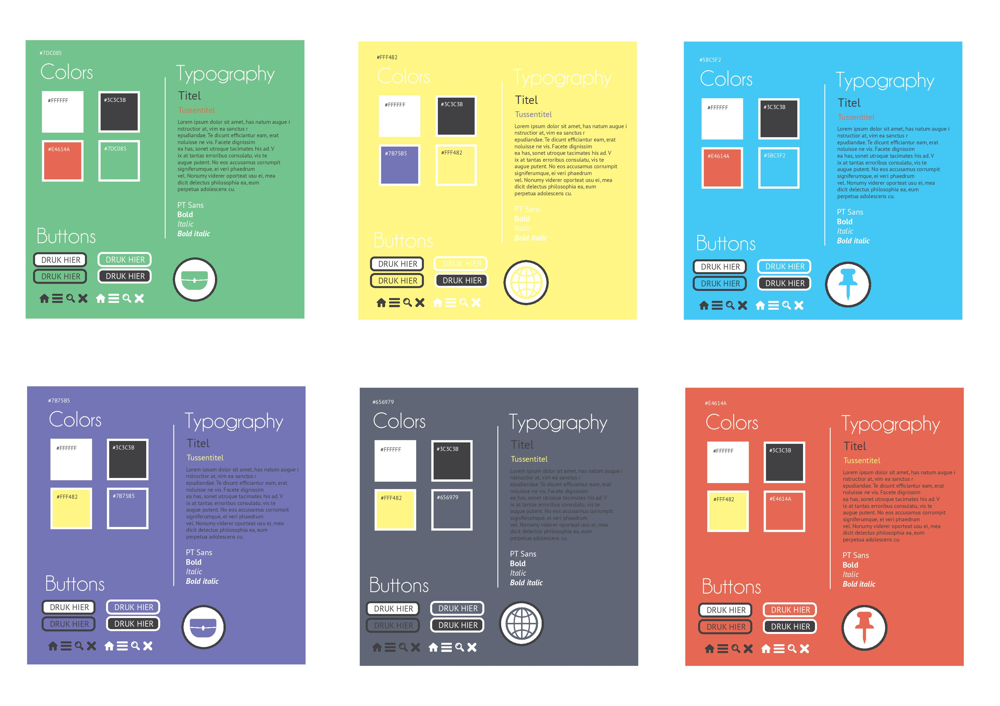
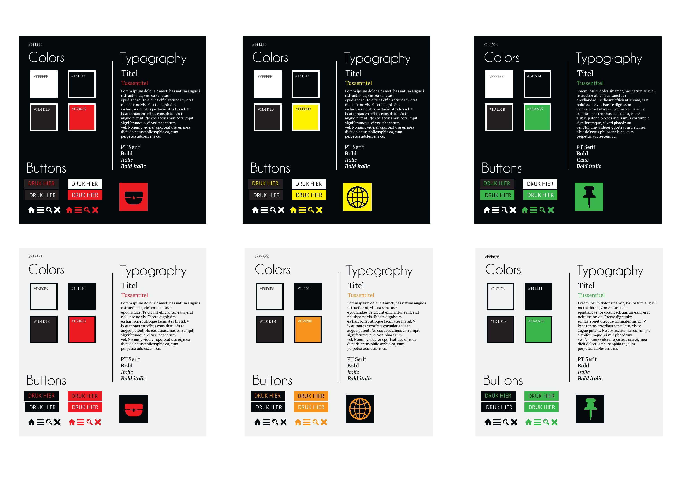
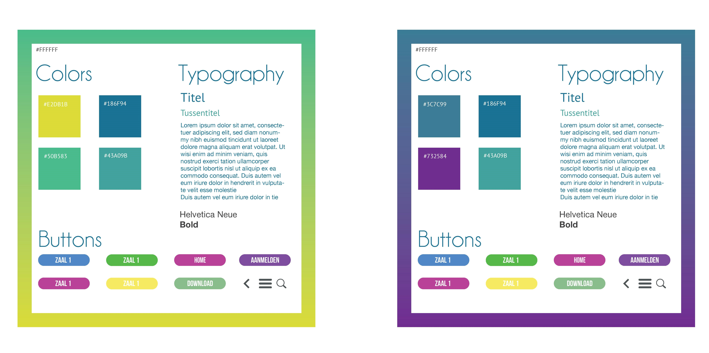

We wisten op voorhand dat we een app voor iOS en WatchOS gingen ontwerpen, dus we moesten gaan kijken naar hun digital guidelines. Het belangrijkste dat ons is bijgebleven, is dat de WatchOS een donkere achtergrond verplicht.

We maken wel een app voor kinderen, dus we wouden sowieso kleurrijk te werk gaan. Een volledig zwarte app zou niet zo in de smaak vallen bij kinderen. **Daarom hebben we gekozen voor een licht design met opvallende kleurtjes.**

Voor de WatchOS kiezen we dan in de plaats van een kleurrijke achtergrond zoals bij de iOS, voor een zwarte.

Alternatief 1
-------------

{: .img}

Alternatief 2
-------------

{: .img}

Gekozen
-------

{: .img}